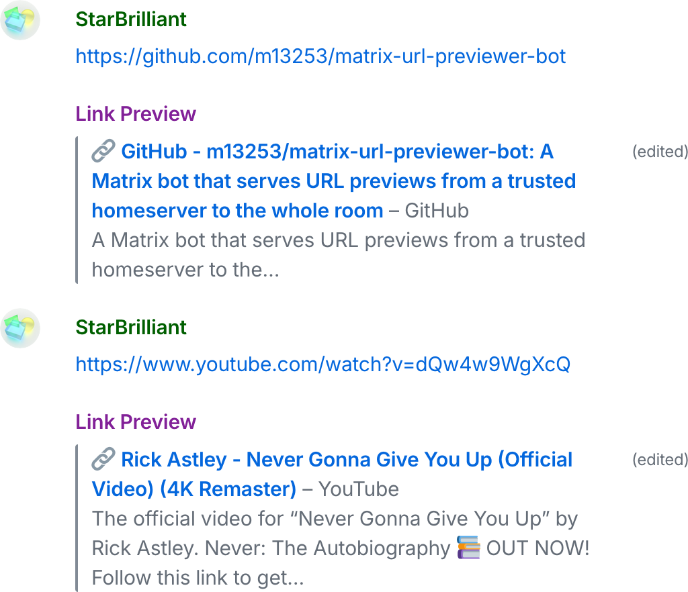

# Matrix-URL-Previewer-Bot

A Matrix bot that serves URL previews from a trusted server to the whole room.

## To website owners

[Matrix](https://matrix.org) is a protocol to build messaging apps, for example, [Element and FluffyChat](https://matrix.org/ecosystem/clients/), similar to Discord and WhatsApp.

Matrix operates like email — different organizations operates Matrix servers independently, but users across organizations can communicate with each other.

Matrix-URL-Previewer-Bot extracts links from Matrix chatrooms and display previews like this:

<p align="center"></p>

Due to the distributed nature of Matrix, HTTP requests using our User-Agent may originate from all over the world. In case if you need to protect your website from malicious attackers and crawlers that pretend to be Matrix-URL-Previewer-Bot, please consider the following:

1. You may identify requests by the **User-Agent** keywords `Matrix-URL-Previewer-Bot`, but please understand that, they identify both legitimate Matrix-URL-Previewer-Bot and malicious ones pretenting to be Matrix-URL-Previewer-Bot.

   (**Note:** The User-Agent keyword `Synapse (bot;` used by [Synapse](https://github.com/element-hq/synapse) also belongs to Matrix-related apps for a similar purpose.)

2. You may employ **rate-limiting**, because a well-behaved Matrix-URL-Previewer-Bot program should never request the same URL repeatedly within 1 hour. 

3. You may prevent malicious crawlers by serving only the **page title** and the **[Open Graph metadata](https://ogp.me)**, omitting the page body, because Matrix-URL-Previewer-Bot doesn’t need page body.

## Benefits of using Matrix-URL-Previewer-Bot over Synapse’s built-in URL previewer

1. Supporting encrypted chatrooms without leaking information to untrusted homeservers.

   We expect chatroom admins to operate Matrix-URL-Previewer-Bot. They are considered more trusted from a room member’s perspective.

2. Ensuring all members of a chatroom, no matter which homeserver they belong to, see the same URL preview.

3. Supporting custom rewrite rules to deal with tricky websites.

## How to run your own Matrix-URL-Previewer-Bot

1. Install the Rust development environment on your server.

   Alternatively, if your server isn't powerful enough for the Rust compiler, you can also build it statically elsewhere and transfer the compiled program to the server. The detailed steps are omitted here.

2. Create a Matrix account for the bot. I suggest registering your bot on [a self-hosted Synapse server](https://element-hq.github.io/synapse/latest/setup/installation.html).

   ```
   $ register_new_matrix_user --no-admin -c homeserver.yaml -t bot
   ```

   The bot account has to use password authentication. Multi-factor authentication and single sign-on are unsupported, as they can’t function unattended.

3. Create a configuration file `config.toml` based on [example-config.toml](./example-config.toml).

4. Perform the setup procedure.

   ```
   $ cargo run --release setup --config=config.toml
   Matrix homeserver: <HOMESERVER>
   User name: <USERNAME>
   Password: <PASSWORD>
   ```

   Depending on whether a backup exists on the server, you may be asked:
   ```
   Backup recovery key: <RECOVERY KEY>
   ```
   Or:
   ```
   Are you ready to reset the cryptographic identity to enable server-side backup (y/n)? y
   Please move <DATA PATH>/recovery-key.txt to a safe place, then press ENTER to continue:
   ```

5. Run the bot.

   ```
   $ cargo run --release run --config=config.toml
   ```

   This step can be set to start automatically on computer bootup.

6. Configure the account profile.

   Use a Matrix client, for example, [Element](https://matrix.org/ecosystem/clients/element/), to log into your bot account. Type in your recovery key when asked.

   Set the profile name to “Link Preview” and the profile picture to [`transparent.png`](img/transparent.png), a 68-byte transparent PNG image.

7. Remove any unverified registration session.

   The `register_new_matrix_user` program mentioned above may have created an unverified session. This session should be removed to prevent encryption problems.

   Go to settings. In the Sessions tab, sign out of any unverified or unrecognized sessions.

8. Join your desired chatrooms.

   Matrix-URL-Previewer-Bot doesn’t respond to any room invitations to prevent abuse. Therefore, you need to join the chatrooms manually through Element.

9. Test whether it works.

10. Sign out of Element.

11. If encryption or account recovery goes wrong.

    Please refer to [matrixbot-ezlogin/Readme.md](https://github.com/m13253/matrixbot-ezlogin/blob/master/Readme.md) for the troubleshooting steps.

## Limitations

1. Matrix-URL-Previewer-Bot cannot preview images yet.

   This is because Matrix doesn’t yet support mixing images and text in encrypted messages.

2. When a user edits their message in quick succession, a race condition may prevent Matrix-URL-Previewer-Bot from correctly respond the last edit.

   The user can workaround this issue by editing the affected message one more time.
